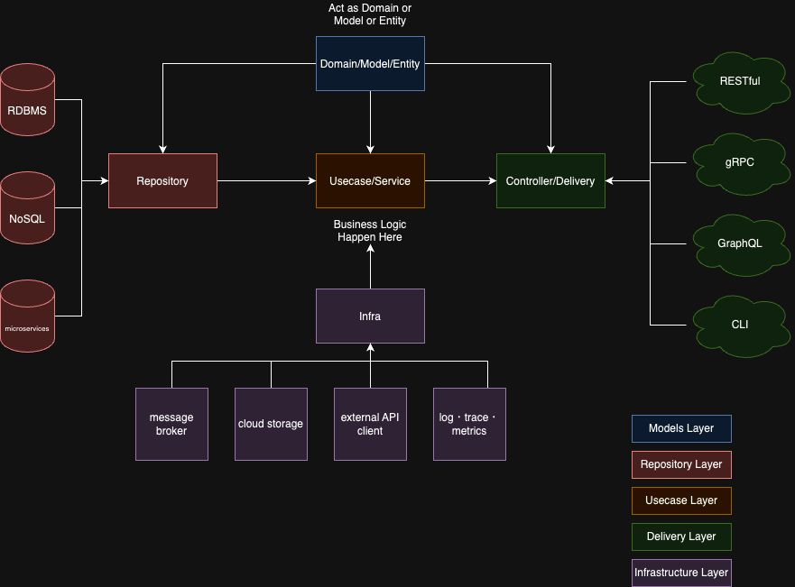

# my-go-clean-architecture

I implemented golang's clean architecture

## Changelog

- **v1**: Proposed on 2024, merged to master on 2024.  
  - Desc:
    - Initial commit.
    - Inspired by [bxcodec/go-clean-arch](https://github.com/bxcodec/go-clean-arch?tab=readme-ov-file)  
    - Details can be seen in this PR TODO:.

## Description

> This is an example of implementation of Clean Architecture in Go (Golang) projects.  
>
> Rule of Clean Architecture by Uncle Bob
>
>- Independent of Frameworks. The architecture does not depend on the existence of some library of feature laden software. This allows you to use such frameworks as tools, rather than having to cram your system into their limited constraints.
>- Testable. The business rules can be tested without the UI, Database, Web Server, or any other external element.
>- Independent of UI. The UI can change easily, without changing the rest of the system. A Web UI could be replaced with a console UI, for example, without changing the business rules.
>- Independent of Database. You can swap out Oracle or SQL Server, for Mongo, BigTable, CouchDB, or something else. Your business rules are not bound to the database.
>- Independent of any external agency. In fact your business rules simply don’t know anything at all about the outside world.
>
>More at <https://8thlight.com/blog/uncle-bob/2012/08/13/the-clean-architecture.html>

This project has 4 Domain layer :

- Models Layer
  - This layer contains all the models of the application.
  - It should not depend on any other layer.
- Repository Layer
  - This layer contains all the database related operations.
- Infrastructure Layer
  - This layer contains all the external operations like sending an email, calling external API, etc.
- Usecase Layer
  - This layer contains all the business logic.
  - Transaction is also implemented in this layer.
- Delivery Layer
  - This layer contains all the delivery mechanism like HTTP, gRPC, etc.

#### The diagram



### How To Run This Project

#### Setup the Environment

```bash
cp .env.sample .env

# install direnv(ref: https://direnv.net/docs/installation.html)
brew install direnv
# active direnv
direnv allow .
```

#### Run the Testing

```bash
make tests
```

#### Run the Applications

Here is the steps to run it with

TODO:

### Building and running your application

When you're ready, start your application by running:
`docker compose up --build`.

Your application will be available at <http://localhost:9090>.

### Deploying your application to the cloud

First, build your image, e.g.: `docker build -t myapp .`.
If your cloud uses a different CPU architecture than your development
machine (e.g., you are on a Mac M1 and your cloud provider is amd64),
you'll want to build the image for that platform, e.g.:
`docker build --platform=linux/amd64 -t myapp .`.

Then, push it to your registry, e.g. `docker push myregistry.com/myapp`.

Consult Docker's [getting started](https://docs.docker.com/go/get-started-sharing/)
docs for more detail on building and pushing.

### References

- [Docker's Go guide](https://docs.docker.com/language/golang/)
